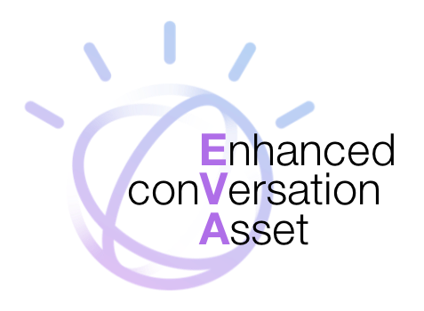
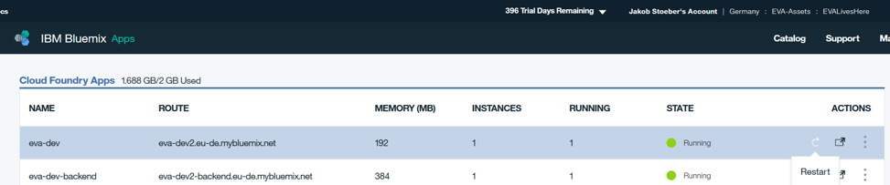
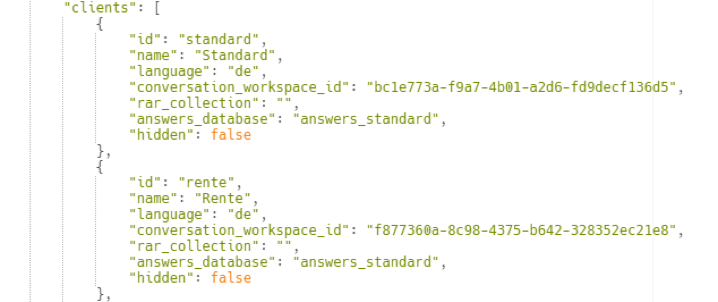

EVA, the **E**nhanced con**V**ersation **A**sset, enables you to start your chatbot *within hours* instead of days by providing the things you'll need besides Watson Conversation Service.  

## How to run a Project with EVA

Please have a look at the EVA Best Practices. This readme will only describe the technical parts.

## Deploy EVA using the Deploy to IBM Cloud button

Clicking on the button below creates an IBM Cloud DevOps Toolchain and deploys EVA to IBM Cloud.

[](https://bluemix.net/devops/setup/deploy?repository=https://github.ibm.com/CognitiveAssetFactory/EVA&repository_token=869a6c8023cd323f68c42d898c09ed60f32b25c0)

## How to run EVA locally

EVA requires Node.JS. After the installation and provision of the source code, you can start EVA with the following commands in your terminal/command line (navigate to your application root folder first):
If you are using a windows machine do the following (otherwise proceed with step2):

**Step 1:** open a cmd with admin rights and execute:
```sh
npm install --global --production windows-build-tools

```

**Step 2:** Install Node.js dependencies

```sh
npm install

npm install -g gulp

npm rebuild node-sass

gulp build
```

**Step 3:** To start your application just type

```sh
gulp
```

## How to configure basic Services  

EVA comes with a basis set of services already integrated into the pipeline. To use them you can simply change the configuration in the database.  

### Change the configuration in the database.  

The other Services (Conversation, Spell Checker, Retrieve&Rank, Speech2Text) can be configured easily in the config collection such the following document.

```
"conversation": {
    "url": "https://gateway-fra.watsonplatform.net/conversation/api",
    "username": "a5e6bb7f-e0c9-45fd-9293-5efc0eece657",
    "password": "M2T61aztUELz",
    "show_alternate_intents": true
},
```

### Submit the changes

To take over the changes from the database into your application, please restart the app under the IBM Cloud console.  



## How to change the UI

### Create Clients in Database

EVA supports multiple clients which is interesting as well for one client and multiple use cases or even designs. To create a client go to the “config” collection in Mongo DB with a tool as MongoBooster. Clients have the following structure:

```
{
    "id": "standard",
    "name": "Standard",
    "language": "de",
    "conversation_workspace_id": "b6e35506-826e-493e-b50f-ae11ed69d95e",
    "rar_collection": "",
    "answers_database": "answers_standard",
    "hidden": false
},
```

In MongoBooster, select config > clients > edit document. Copy the JSON structure of a client as depicted above and change id, name as well as the conversation workspace ID. If you want to set up a net answer store for this client, you can also change the answers_database variable. When you are finished click “run”.  



As a second action in MongoBooster you have to give the admin user access to the new client. In order to do so, select users > clients and add your new client to the list of existing clients. Please do not do further changes to this user.  

### Change the UI


Next, in the following folders you have to copy the folder of an existing client (e.g. “standard”) and rename it to the id you set in MongoDB (e.g. “rente”). Please choose an existing client as you like to have the template.
* Frontend/src/sass/
* Frontend/src/views/

Important: Every client has his primary Conversation and Retrieve and Rank workspace. You need to insert the workspace/service ID there. If you need guidance please have a look at our example configuration in appendix.

## Further Information needed?
Have a look at our wiki (Cognitive Asset Factory): <http://ibm.biz/eva-asset>
Or read our technical documentation: <https://ibm.ent.box.com/file/190950663582>
