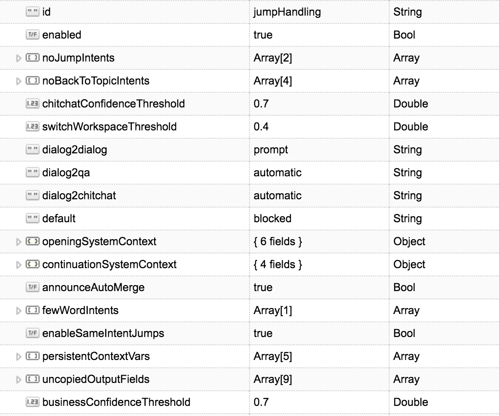
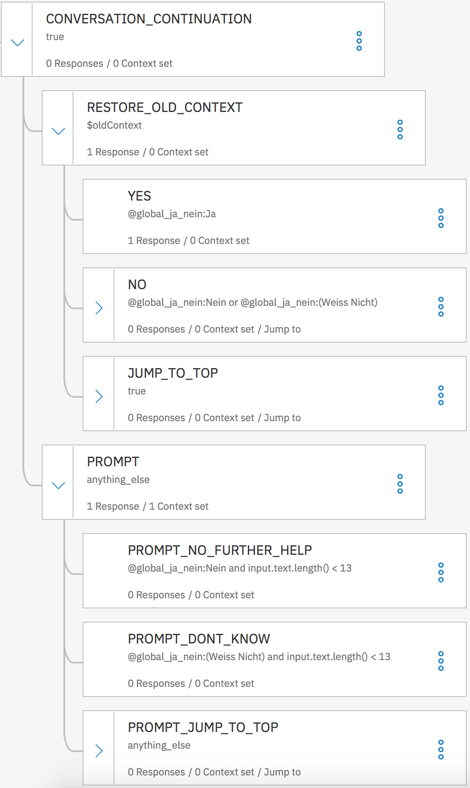

# jumpHandler

The ability to handle conversational jumps between separate dialog flows, QA and chit chat helps you to make your chat bot more flexible and human. Nevertheless, this is a new feature and needs thorough testing. The jump handling basically relies on two major components: the handleJump stage in the pipeline and some additions to the business WCS workspace.

handleJump is a separate pipeline step. You can find the code in pipeline/steps/handleJump/step_handleJump.js and its corresponding util class. The jumpHandler takes the current resultHolder object and a conversationStore object which holds the service itself and the workspace ids for the business and chitchat workspaces as input parameters. The resultHolder.session object holds some crucial information like the previous resultHolders or stored context that might be important for further processing.

### Configuration

The jumpHandler aims to be a highly configurable feature for the Enhanced conVersation Asset (EVA). Therefore you can adjust its configuration in the config database/collection by updating the jumpHandling document.


<p align="center">
    
</p>

| Property | Values | Description |
| -------- | ------ | ----------- |
| enabled  | Bool: true/false | enable/disable jumps |
| noJumpIntents | Array | Array of strings containing the names of the intents that cannot be the target of a jump |
| noBackToTopicIntents | Array | Array of strings containing the names of the intents that will not return to its origin after the jump was executed |
| businessConfidenceThreshold | Double: 0 <= Double <= 1 | minimum confidence level to jump in the business dialog from one dialog to another or QA |
| chitchatConfidenceThreshold | Double: 0 <= Double <= 1 | minimum confidence level to jump from a business dialog to chit chat |
| switchWorkspaceThreshold | Double: 0 <= Double <= 1 | maximum confidence level a business workspace intent can have to qualify for checking the chitchat workspace |
| dialog2dialog | String: blocked/prompt/automatic* | behaviour how a branch will be merged to the previous topic at the end |
| dialog2qa | String: blocked/prompt/automatic* | behaviour how a branch will be merged to the previous topic at the end |
| dialog2chitchat | String: blocked/prompt/automatic* | behaviour how a branch will be merged to the previous topic at the end |
| default | String: blocked/prompt/automatic* | default value for dialog2dialog, dialog2qa and dialog2chitchat if not present |
| openingSystemContext | JSON Object | the context.system object right after exiting the welcome/ conversation_start dialog node |
| continuationSystemContext | JSON Object | the context.system object right after exiting the conversation continuation dialog node (further explanation follows below as this requires adjustments to the WCS business workspace) |
| announceAutoMerge | Bool: true/false | if jump behaviour is set to automatic, the 'Back_to_topic_automatic' answer_id will be added between the new answer in response to the jump and the restored answer |
| fewWordIntents | Array | Array of strings containing the names of the intents that do not need to fulfill the required minimum amount of words for a jump |
| enableSameIntentJumps | Bool: true/false | enables/disables jumps from and to the same intent |
| persistentContextVars | Array | Array of strings containing the names of the context variables that should be persistent in context even after jumps |
| uncopiedOutputFields | Array | Array of strings containing the property names of output fields that will not be merged automatically |

+ **\*Blocked**: no jumps allowed
+ **Prompt**: prompt after exiting one branch whether you want to restore the previous topic if present or not
+ **Automatic**: automatically merge with the previous topic after exiting the branchThe handleJump is a cohesive and self-contained function. If you want to adjust its output or conditions or if you need to fix a bug,do it in the jumpHandler.js.

A sample config will be included in the EVA setup.

### WCS requirements

There are basically three requirements for your business WCS workspace:
1. All dialog flows need a context variable **isDialog: true**, all others (so all QA nodes with no child nodes) a context variable **isDialog: false**
2. At the end of each dialog flow branch you need to add a **jump to the conversation continuation node** (Evaluate response)
3. Add dialog nodes which cover the actual continuation/restoration of the conversation


<p align="center">
    
</p>

##### Dialog nodes
###### CONVERSATION_CONTINUATION
* Condition: `true`
* Jump to: -
    ``` json
    {
      "output": {
        "actions": "<? output.actions.append('checkForOldContext') ?>",
        "prevent_override": true
      }
    }
    ```

###### RESTORE_OLD_CONTEXT
* Condition: `$oldContext`
* Jump to: -
    ``` json
    {
      "output": {
        "text": {
          "values": [
            "Back_to_topic_prompt"
          ],
          "selection_policy": "random"
        },
        "answer_id": "<? output.answer_id.append('Back_to_topic_prompt') ?>",
        "prevent_override": true
      }
    }
    ```
    The ‘back_to_topic_prompt’ asks whether the user wants to continue with topic x where x is the previous topic’s intent as a variable which will be resolved through the variable store.

###### YES
* Condition: yes-Entity, e.g. `@global_ja_nein:Ja`
* Jump to: -
    ``` json
    {
      "output": {
        "actions": "<? output.actions.append('restoreOldContext') ?>",
        "prevent_override": true,
        "text": {
          "values": []
        }
      }
    }
    ```

###### NO
* Condition: no/not sure-Entity, e.g. `@global_ja_nein:Nein || @global_ja_nein:(Weiss Nicht)`
* Jump to: `PROMPT (Evaluate condition)`
    ``` json
    {
      "output": {
        "actions": "<? output.actions.append('purgeOldContext') ?>",
        "prevent_override": true
      }
    }
    ```

###### JUMP_TO_TOP
* Condition: `true`
* Jump to: `PROFANITY (Evaluate condition)`
    ``` json
    {
      "output": {
        "actions": "<? output.actions.append('purgeOldContext') ?>",
        "prevent_override": true
      }
    }
    ```

###### PROMPT
* Condition: `anything_else`
* Jump to: -
    ``` json
    {
      "output": {
        "text": {
          "values": [
            "Gesprächserhaltung_01"
          ],
          "selection_policy": "random"
        },
        "actions": "<? output.actions.append('purgeOldContext') ?>",
        "answer_id": "<? output.answer_id.append('Gesprächserhaltung_01') ?>",
        "prevent_override": true
      }
    }
    ```
    The ‘conversation_continuation’ answer_id is a generic question whether we can be of further assistance to the user if there is no previous topic to be restored.

###### PROMPT_NO_FURTHER_HELP
* Condition: No-Entity && input.text.length() < 13, e.g. `@global_ja_nein:Nein && input.text.length() < 13`
* Jump to: -
    ``` json
    {
      "output": {
        "prevent_override": true
      }
    }
    ```

###### PROMPT_DONT_KNOW
* Condition: Not sure-Entity && input.text.length() < 13, e.g. `@global_ja_nein:(Weiss Nicht) && input.text.length() < 13`
* Jump to: -
    ``` json
    {
      "output": {}
    }
    ```

###### PROMPT_JUMP_TO_TOP
* Condition: `anything_else`
* Jump to: `PROFANITY (Evaluate condition)`
    ``` json
    {
      "output": {
        "actions": "<? output.actions.append('purgeOldContext') ?>"
      }
    }
    ```

**Important notice**: the jumpHandler has its own function for callConversation. By doing so conversational jumps can be handled in a single stage. If you make major changes to the callConversation function in the callConversation pipeline step it's very likely that you need to apply those changes to callConversation method in the jumpHandler as well.

### Variables

As we prompt for the restoration of the old context via variables, we need to set one for every possible dialog intent.
E.g.: "Do you want to continue with ${topic}", where ${topic} will be replaced with the previous topic which is the intent of the previous dialog.

### Step by step
1. Apply the changes described above to your business WCS workspace.
    + Add a variable isDialog: true to all dialog flow nodes' first context (nodes with child nodes) and a variable isDialog: false to all QA nodes' first context (nodes without child nodes). One option is to create folders in WCS; one for dialog driven nodes which defines the context for all child nodes which are the actual dialog flows and one for QA driven nodes which defines the context for all child nodes which are QA nodes without child nodes.
    + Add the conversation continuation nodes to your WCS workspace as described above at the end of the root, even after the anything_else statement so it can only be reached via jumps.
    + Add a jump to the conversation continuation node (Evaluate response) from each conversational end of a dialog flow.
2. Extract and store the system context right after the first conversation_start/welcome node and the conversation continuation node. You can just log the context.system object.
3. Add answers for the anwer_ids `conversation_continuation`, `back_to_topic_prompt` and `back_to_topic_automatic` to Answer Store, e.g.
    + `conversation_continuation`: 'How can I be of further assistance to you?',
    + `back_to_topic_prompt`: 'Do you want to continue with ${topic}',
    + `back_to_topic_automatic`: 'Let's continue with our previous topic...'
4. Add a variable to the Variable Store for each intent that maps to a dialog flow with intent.name as variable name and the text you want to replace the ${topic} variable in answer_id `back_to_topic_prompt` with as variable value.
5. Add the configuration to the DB's jumpHandling config document as described above with the extracted system contexts.


### Code Hints

#### Enabled jumps

##### Preparations

###### storeTopIntent
```js
newInput = storeTopIntent(newInput);

function storeTopIntent(resultHolder) {
    resultHolder.session.handleJump.topIntent = {
        name: resultHolder.output.topIntent,
        confidence: resultHolder.output.confidence
    };
    return resultHolder;
}
```
Stores the current topIntent (name, confidence) from the previous conversation steps in the handleJump session object to make it persistent and accessible for future requests and further processing.

###### manageContextStore
```js
newInput.session.handleJump.contextStore = manageContextStore(newInput);

function manageContextStore(resultHolder) {
    var contextStore = resultHolder.session.handleJump.contextStore;

    contextStore.unshift({
        payloadContext: cloneElement(resultHolder.payload.context),
        sessionContext: cloneElement(resultHolder.session.context),
        topIntent: cloneElement(resultHolder.session.handleJump.topIntent),
        wasMerged: cloneElement(resultHolder.session.handleJump.wasMerged),
        answerFrom: cloneElement(resultHolder.answerFrom),
        input: cloneElement(resultHolder.input),
        output: cloneElement(resultHolder.output),
        actions: cloneElement(resultHolder.output.actions)
    });

    if (contextStore.length > 3) {
        contextStore.pop();
    }

    return contextStore;
}

function cloneElement(element) {
    return (element ? JSON.parse(JSON.stringify(element)) : null);
}
```
Stores the most relevant information from the current resultHolder that might be relevant for a future restoration of a previous dialog state. The contextStore is stored in the handleJump session object and basically acts like a shift register as only the previous three resultHolders are stored.

###### mockOldInput
```js
oldInput = mockOldInput(newInput);

function mockOldInput(resultHolder) {
    return {
        session: {
            context: resultHolder.session.handleJump.contextStore[0].sessionContext,
            handleJump: {
                topIntent: resultHolder.session.handleJump.contextStore[1].topIntent,
                wasMerged: resultHolder.session.handleJump.contextStore[0].wasMerged
            }
        },
        input: resultHolder.session.handleJump.contextStore[0].input,
        output: {
            actions: resultHolder.session.handleJump.contextStore[1].actions
        },
        answerFrom: resultHolder.session.handleJump.contextStore[1].answerFrom
    }
}
```
As the resultHolder from the previous request (oldInput) is crucial for deciding if a jump is required or not, this resultHolder will be modelled by mocking the typical resultHolder structure and using the necessary information from the contextStore.

###### createPreviousTopic
```js
newInput = createPreviousTopic(newInput, oldInput, jumpConfig);

function createPreviousTopic(newInput, oldInput, jumpConfig) {
    if (oldInput === undefined) return newInput;

    var oldTopIntent = getTopIntentFromSession(oldInput);
    var newTopIntent = getTopIntentFromSession(newInput);

    if (!newInput.session.handleJump.hasOwnProperty('previousTopic') && oldTopIntent && !oldInput.session.handleJump.wasMerged && jumpConfig.noJumpIntents.indexOf(newTopIntent.name) === -1 && (jumpConfig.enableSameIntentJumps || newTopIntent.name != oldTopIntent.name) && oldInput.answerFrom !== "callChitChat" && oldInput.output.actions.indexOf('deadEnd') === -1) {
        newInput.session.handleJump.previousTopic = oldTopIntent.name;
    }

    return newInput;
}

function getTopIntentFromSession(resultHolder) {
    if (resultHolder.session.hasOwnProperty('handleJump')) return resultHolder.session.handleJump.topIntent ? resultHolder.session.handleJump.topIntent : undefined;
    return undefined;
}
```
The previousTopic property defines the intentName we will return to in case of a restoration and replaces the ${topic} variable in the prompt, e.g. "Do you want to continue with ${topic}" turns into "Do you want to continue with ${previousTopic}?" which will be resolved by the variableStore in a later pipeline step. The previousTopic is only created when the following conditions apply:

+ `!newInput.session.handleJump.hasOwnProperty('previousTopic')`: the handleJump session object does not have a previousTopic property yet
+ `oldTopIntent`: the oldTopIntent variable is not null or undefined
+ `!oldInput.session.handleJump.wasMerged`: the oldInput is not the result of a merge of two resultHolders
+ `jumpConfig.noJumpIntents.indexOf(newTopIntent.name) === -1`: the current newTopIntent is not one of the noJumpIntents which prohibits jumps for those intents
+ `(jumpConfig.enableSameIntentJumps || newTopIntent.name != oldTopIntent.name)`: newTopIntent and oldTopIntent are not the same, so you can not jump to the beginning of the same intent, or same-intent-jumps are explicitly enabled in the jumpHandling config
+ `oldInput.answerFrom !== "callChitChat"`: the oldInput is not the result of chitchat output
+ `oldInput.output.actions.indexOf('deadEnd') === -1`: the oldInput did not result in a dead end, e.g. "how can you help me?"

##### Conditions

###### jumpHandler-specific actions
```js
if (newInput.output.actions && newInput.output.actions.indexOf("checkForOldContext") === -1 && newInput.output.actions.indexOf("restoreOldContext") === -1 && newInput.output.actions.indexOf("purgeOldContext") === -1) {
    ...
}
```
Whenever one of the jumpHandler-specific actions, i.e. checkForOldContext, restoreOldContext or purgeOldContext, is present, a jump can never be required as WCS currently points on one of jumpHandler dialog nodes and a different action needs to be performed by the jumpHandler. The actions themselves will be explained later on.

###### evaluateJumpConditions
```js
if (evaluateJumpConditions(newInput, oldInput, jumpConfig)) {
    ...
}

function evaluateJumpConditions(newInput, oldInput, jumpConfig) {
    if (oldInput === undefined) return false;

    var newContext = newInput.session.context;

    var oldTopIntent = getTopIntentFromSession(oldInput);
    var newTopIntent = getTopIntentFromSession(newInput);

    if (newInput.answerFrom !== "callChitChat" && newContext.isDialog && ((newInput.input.text && newInput.input.text.split(' ').length > 2) || jumpConfig.fewWordIntents.indexOf(newTopIntent.name) !== -1) && !oldInput.session.context.system.hasOwnProperty('branch_exited')) {
        if (newInput.output.actions && newInput.output.actions.indexOf("preventJump") === -1 && oldInput.output.actions.indexOf('callFindQuestions') === -1 && oldInput.answerFrom !== "callChitChat") {
            if (newInput.session.handleJump.previousTopic && (jumpConfig.enableSameIntentJumps || newTopIntent.name != newInput.session.handleJump.previousTopic)) {
                return true;
            } else {
                return false;
            }
        } else {
            return false;
        }
    } else {
        return false;
    }
}
```
Besides the jumpHandler-specific actions a bunch of conditions have to be met to qualify a resultHolder for a jump. The general conditions that apply for jumps to the business and chitchat workspace are:

+ `newInput.answerFrom !== "callChitChat"`: the current answer may not be a result of the chitchat
+ `newContext.isDialog`: the current context is a dialog, otherwise there is no need to jump anyway as we already reached the end of a branch
+ `(newInput.input.text && newInput.input.text.split(' ').length > 2) || jumpConfig.fewWordIntents.indexOf(newTopIntent.name) !== -1`: the current input consists of more than two words, so that one-word-responses that might get high confidences on certain intents unintentionally can't trigger jumps, or the current intent is one of the fewWordIntents, specified in the jumpHandling config, which explicitly allows this intent to have less or equal to 2 words, e.g. "goodbye"
+ `!oldInput.session.context.system.hasOwnProperty('branch_exited')`: the oldInput has not already exited a branch because there is no reason to jump
+ `newInput.output.actions.indexOf("preventJump") === -1`: jump is not prevented by WCS
+ `oldInput.output.actions.indexOf('callFindQuestions')`: oldInput may not be the result from a one-word-search as this would not be suitable for restoration
+ `oldInput.answerFrom !== "callChitChat"`: the previous answer may not be a result of the chitchat
+ `newInput.session.handleJump.previousTopic`: the previousTopic property needs to be defined
+ `(jumpConfig.enableSameIntentJumps || newTopIntent.name != newInput.session.handleJump.previousTopic))`: newTopIntent and oldTopIntent are not the same, so you can not jump to the beginning of the same intent, or same-intent-jumps are explicitly enabled in the jumpHandling config

###### workspace-specific conditions
As EVA uses different workspaces for its actual purpose (business) and chitchat, we also need to differentiate between workspace-specific jump conditions, i.e. separate conditions for dialog and QA jumps for the business workspace and chitchat jumps for the chitchat workspace

_business workspace_
```js
if (newTopIntent.confidence > businessConfidenceThreshold && newTopIntent.name != config.conversation.offtopic ) {
    ...
}
```
+ `newTopIntent.confidence > businessConfidenceThreshold`: newTopIntent.confidence needs to be greater than the minimum confidence we set as threshold to qualify for a jump
+ `newTopIntent.name != config.conversation.offtopic`: the current topIntent may not be equal to the offTopic intent as it points to the chitchat

_chitchat workspace_
```js
if ((config.chitchat && config.chitchat.enabled) && (newTopIntent.confidence < switchWorkspaceThreshold || newTopIntent.name == config.conversation.offtopic)) {
    ...
    if (chitchatInput.output.confidence > chitchatConfidenceThreshold) {
        ...
    }
}
```
+ `(config.chitchat && config.chitchat.enabled)`: chitchat needs to be enabled
+ `(newTopIntent.confidence < switchWorkspaceThreshold || newTopIntent.name == config.conversation.offtopic)`: the current topIntent confidence is less than the switchWorkspaceThreshold, i.e. the confidence from the business workspace is so small that it's worth checking the chitchat workspace if there a more applicable intent can be found, or the topIntent is equal to the business workspace's offTopic intent which also points to the chitchat
+ `chitchatInput.output.confidence > chitchatConfidenceThreshold`: in accordance to the business workspace the confidence of the top intent classified by the chitchat workspace needs to be greater than the minimum confidence we set as threshold to qualify for a jump

##### Methods

###### executeJump
```js
function executeJump(newInput, oldInput, conversation, workspace, jumpConfig, callback) {
    if (newInput.session.context.isDialog && jumpConfig.dialog2dialog == "blocked") {
        return callback(null, newInput);
    }
    ...

    var temp;
    if (newInput.session.handleJump.contextStore[1].actions.indexOf("restoreOldContext") === -1) {
        temp = JSON.parse(JSON.stringify(newInput.session.handleJump.contextStore[1]));
        newInput.session.handleJump.tempStorage = temp;
    } else {
        temp = newInput.session.handleJump.tempStorage;
    }

    var payload = {
        workspace_id: workspace,
        context: {
            system: jumpConfig.openingSystemContext
        },
        output: {
            answer_id: [],
            actions: []
        },
        input: newInput.input,
        alternate_intents: config.conversation.show_alternate_intents
    };

    ...

    callConversation(newInput, conversation, payload, "callConversation", function(err, output) {
        if (!err) err = null;
        if (output.session.context.hasOwnProperty('isDialog') && output.session.context.isDialog) {
            output.session.handleJump.storedContext = temp;
        }
        return callback(err, output);
    });
}
```
The temp variable holds a reference to the contextStore object that should be restored in case of the restoreOldContext action. To execute a jump a new conversation request will be performed with the newInput.input and the jumpConfig.openingSystemContext as payload. If the output is a dialog the temp variable will be stored as the storedContext on the session.

###### checkForOldContext
```js
if (newInput.session.handleJump.storedContext) {
    if (jumpConfig.dialog2dialog != "automatic") {
        ...

        continueWithConversation(newInput, true, conversation, workspace, jumpConfig, function(err, newInput) {
            if (err) return handleError(err, newInput, callback);

            return callback(null, newInput);
        });
    } else {
        restoreOldContext(newInput, jumpConfig, conversation, workspace, function(err, output) {
            if (err) return handleError(err, newInput, callback);

            ...
            return callback(null, output);
        });
    }
} else {
    continueWithConversation(newInput, false, conversation, workspace, jumpConfig, function(err, newInput) {
        if (err) return handleError(err, newInput, callback);

        return callback(null, newInput);
    });
}

function continueWithConversation(resultHolder, oldContext, conversation, workspace, jumpConfig, callback) {
    resultHolder.debug.handleJump.action = "continueWithConversation";

    var previousTopic = resultHolder.session.handleJump.previousTopic;
    if (oldContext && previousTopic && jumpConfig.noBackToTopicIntents.indexOf(previousTopic) === -1) {
        resultHolder.session.context.oldContext = true;
    } else {
        resultHolder.session.context.oldContext = false;
        delete resultHolder.session.handleJump.storedContext;
    }

    var payload = {
        workspace_id: workspace,
        context: resultHolder.session.context,
        output: resultHolder.output,
        input: {
            text: ""
        },
        alternate_intents: config.conversation.show_alternate_intents
    };

    var oldOutput = JSON.parse(JSON.stringify(resultHolder.output));

    callConversation(resultHolder, conversation, payload, "callConversation", function(err, output) {
        if (!err) err = null;
        output.session.handleJump.topIntent = {
            name: output.output.topIntent,
            confidence: output.output.topConfidence
        };

        output.output.topIntent = oldOutput.topIntent;
        output.output.confidence = oldOutput.confidence ? oldOutput.confidence : output.output.confidence;

        return callback(err, output);
    });
}
```
If a storedContext exists the jumpHandler will, depending on the restoration mode (prompt, automatic, blocked), continue with conversation (prompt) or immediately restore the storedContext. Otherwise the jumpHandler will point WCS to the PROMPT dialog node which will only ask if the chatbot can be of further assistance.

###### restoreOldContext
```js
if (newInput.output.actions.indexOf("restoreOldContext") !== -1) {
    restoreOldContext(newInput, jumpConfig, conversation, workspace, function(err, returnedNewInput) {
        if (err) return handleError(err, newInput, callback);

        return callback(null, returnedNewInput);
    });
}

function restoreOldContext(resultHolder, jumpConfig, conversation, workspace, callback) {
    ...

    var payload = {
        workspace_id: workspace,
        context: storedContext.payloadContext,
        output: {
            answer_id: [],
            actions: []
        },
        input: storedContext.input,
        alternate_intents: config.conversation.show_alternate_intents
    };

    ...

    callConversation(resultHolder, conversation, payload, "callConversation", function(err, output) {
        if (!err) err = null;

        delete output.session.handleJump.storedContext;
        delete output.session.context.previousTopic;
        if (output.currentContext) delete output.currentContext.previousTopic;

        return callback(err, output);
    });
}
```
If the restoreOldContext action is triggered, the jumpHandler will restore the previous context by using the storedContext object which has all necessary information including payloadContext and input. After the callConversation step was executed and the resultHolder is restored, the storedContext and the previousTopic objects will be deleted.

###### purgeOldContext
```js
if (newInput.output.actions.indexOf("purgeOldContext") !== -1) {
    purgeOldContext(newInput, function(err, returnedNewInput) {
        if (err) return handleError(err, newInput, callback);

        return callback(null, returnedNewInput);
    });
}

function purgeOldContext(resultHolder, callback) {
    resultHolder.debug.handleJump.action = "purgeOldContext";
    logPurge();

    var topIntent = JSON.parse(JSON.stringify(resultHolder.session.handleJump.topIntent));
    var contextStore = JSON.parse(JSON.stringify(resultHolder.session.handleJump.contextStore));
    delete resultHolder.session.handleJump;
    resultHolder.session.handleJump = {
        topIntent: topIntent,
        contextStore: contextStore
    }

    delete resultHolder.session.context.previousTopic;
    if (resultHolder.currentContext) delete resultHolder.currentContext.previousTopic;

    return callback(null, resultHolder);
}
```
If the purgeOldContext action is triggered, the jumpHandler will basically delete the whole resutHolder.session.handleJump object, but keeps the topIntent and contextStore properties as they are important for future requests and the jump conditions.

#### Disabled jumps
```js
if (newInput.output.actions && newInput.output.actions.indexOf("checkForOldContext") !== -1) {
    continueWithConversation(newInput, false, conversationStore.business.service, conversationStore.business.workspace, jumpConfig, function(err, output) {
        if (err) {
            let warning = "ERROR occurred during jumpHandling, returning input resutHolder! Caused by: " + err;
            return callback(warning, newInput);
        }
        return callback(null, output);
    });
} else {
    return callback(null, newInput);
}
```
In case WCS points currently on the CONVERSATION_CONTINUATION node (checkForOldContext action) the jumpHandler moves the pointer to the PROMPT node and returns the new resultHolder. Otherwise the input resultHolder will be returned immediately.
